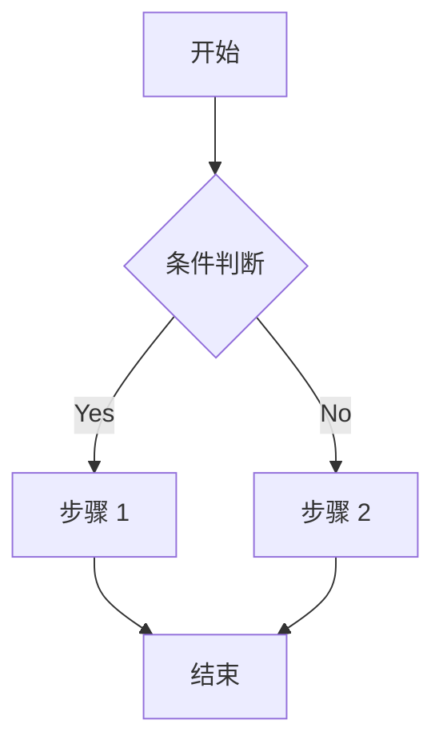
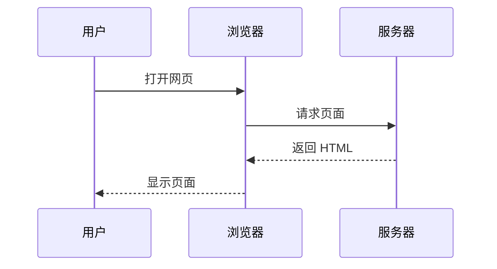
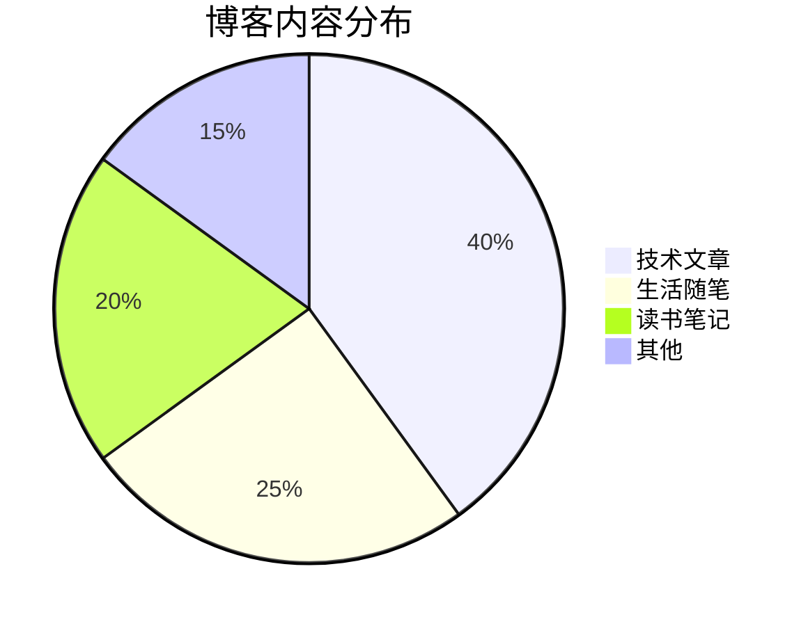

# 使用 Mermaid 绘制各种图表

本文演示如何在 Markdown 文档中使用 Mermaid 创建各种复杂的图表，包括流程图、时序图、甘特图、类图、状态图等。

## 流程图示例

流程图非常适合表示流程或算法步骤：

```mermaid
graph TD
    A[开始] --> B{条件判断}
    B -->|Yes| C[步骤 1]
    B -->|No| D[步骤 2]
    C --> E[结束]
    D --> E[结束]
```

## 时序图示例

展示对象之间的交互时序：

```mermaid
sequenceDiagram
    participant 用户
    participant 浏览器
    participant 服务器
    
    用户->>浏览器: 打开网页
    浏览器->>服务器: 请求页面
    服务器-->>浏览器: 返回 HTML
    浏览器-->>用户: 显示页面
```

## 饼图示例

```mermaid
pie title 博客内容分布
    "技术文章" : 40
    "生活随笔" : 25
    "读书笔记" : 20
    "其他" : 15
```

画图功能是不是很强大！🎉
