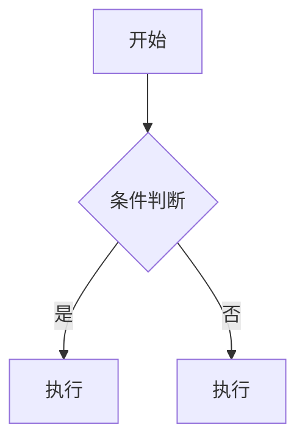

# Markdown 语法速查表

这是一篇 Markdown 语法的简单教程，涵盖了常用的语法和扩展语法。

## 目录

- [块级元素](#块级元素)
  - [段落和换行](#段落和换行)
  - [标题](#标题)
  - [引用](#引用)
  - [列表](#列表)
  - [代码块](#代码块)
  - [分隔线](#分隔线)
  - [表格](#表格)
- [行内元素](#行内元素)
  - [链接](#链接)
  - [强调](#强调)
  - [行内代码](#行内代码)
  - [图片](#图片)
  - [删除线](#删除线)

---

## 块级元素

### 段落和换行

一个空行（只包含空格或制表符的行）来分隔段落。

### 标题

用 `#` 号来表示标题，1-6 个 # 号对应标题级别：

```markdown
# 一级标题
## 二级标题
### 三级标题
###### 六级标题
```

**预览效果：**

# 一级标题
## 二级标题
### 三级标题
###### 六级标题

### 引用

用 `>` 符号创建引用块：

```markdown
> 这是一段引用文字。
> 
> 这是引用的第二段。
```

**预览效果：**

> 这是一段引用文字。
> 
> 这是引用的第二段。

Mizuki 主题还支持多种提示框：

```markdown
> [!NOTE]
> 提示信息

> [!TIP]
> 小技巧

> [!WARNING]
> 警告信息

> [!IMPORTANT]
> 重要信息

> [!CAUTION]
> 小心注意
```

### 列表

支持有序列表和无序列表：

**无序列表：**
```markdown
- 项目一
- 项目二
  - 子项目 A
  - 子项目 B
```

**有序列表：**
```markdown
1. 第一项
2. 第二项
3. 第三项
```

### 代码块

用三个反引号 ``` 包裹代码块：

    ```javascript
    function hello() {
        console.log("Hello, world!");
    }
    ```

**预览效果：**

```javascript
function hello() {
    console.log("Hello, world!");
}
```

### 分隔线

用三个或更多的 `-`、`*` 或 `_` 创建分隔线：

```markdown
---
```

**预览效果：**

---

### 表格

使用管道符和横线来创建：

```markdown
| 姓名 | 年龄 | 城市 |
|-----|-----|-----|
| 张三 | 20 | 北京 |
| 李四 | 25 | 上海 |
```

**预览效果：**

| 姓名 | 年龄 | 城市 |
|-----|-----|-----|
| 张三 | 20 | 北京 |
| 李四 | 25 | 上海 |

---

## 行内元素

### 链接

```markdown
[Astro 官网](https://astro.build/)
```

**预览效果：**

[Astro 官网](https://astro.build/)

### 强调

```markdown
**粗体文字** 和 *斜体文字*
```

**预览效果：**

**粗体文字** 和 *斜体文字*

### 行内代码

```markdown
使用 `console.log()` 函数
```

**预览效果：**

使用 `console.log()` 函数

### 图片

```markdown
![图片描述](图片链接]
```

### 删除线

```markdown
~~删除线文字~~
```

**预览效果：**

~~删除线文字~~

---

## 扩展功能

Mizuki 主题还有这些扩展功能：

- GitHub 卡片：

```markdown
::github{repo="Zatops"}
```

Mermaid 图表：



祝写作愉快！📝
